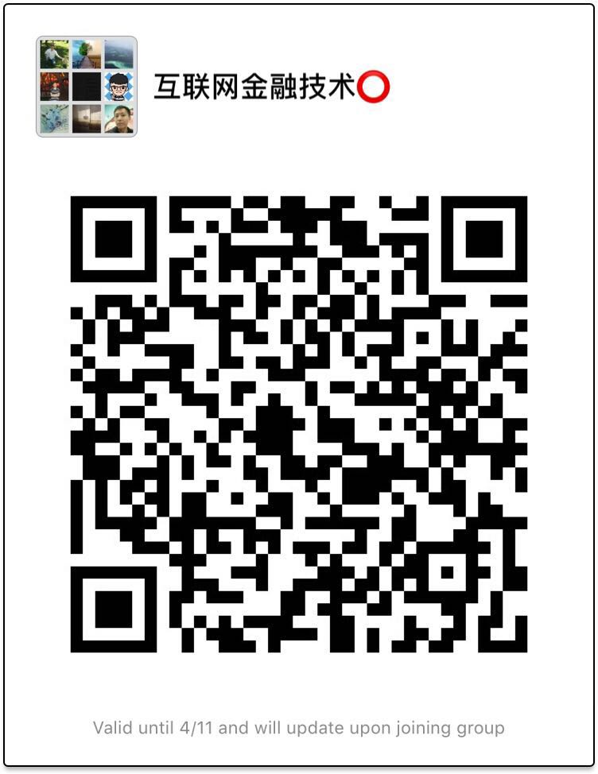

# Vesta

**Vesta**是一款通用的ID产生器，互联网俗称统一发号器，它具有全局唯一、粗略有序、可反解和可制造等特性，它支持三种发布模式：嵌入发布模式、中心服务器发布模式、REST发布模式，根据业务的性能需求，它可以产生最大峰值型和最小粒度型两种类型的ID，它的实现架构使其具有高性能，高可用和可伸缩等互联网产品需要的质量属性，是一款通用的高性能的发号器产品。

## 主页
>访问独立主页: **[http://vesta.cloudate.net/](http://vesta.cloudate.net/)**

## 版本

>当前版本: **[0.0.1](http://vesta.cloudate.net/vesta/doc/Vesta.html)**

## 发布包下载

- **[*REST发布模式（Netty）*](http://vesta.cloudate.net/vesta/bin/vesta-rest-netty-0.0.1-bin.tar.gz)**
- **[*REST发布模式（Tomcat）*](http://vesta.cloudate.net/vesta/bin/vesta-rest-0.0.1-bin.tar.gz)**
- **[*中心服务器发布模式*](http://vesta.cloudate.net/vesta/bin/vesta-server-0.0.1-bin.tar.gz)**
- **[*嵌入式发布模式*](http://vesta.cloudate.net/vesta/bin/vesta-lib-0.0.1.tar.gz)**

## 源码下载

- **[*打包源码*](http://vesta.cloudate.net/vesta/bin/vesta-src-0.0.1.tar.gz)**
- **[*项目源码*](http://vesta.cloudate.net/vesta/bin/vesta-all-src-0.0.1.tar.gz)**

## 文档

- ***<a href="http://vesta.cloudate.net/vesta/doc/统一发号器(Vesta) - 架构设计.html">架构设计</a>***
- ***<a href="http://vesta.cloudate.net/vesta/doc/统一发号器(Vesta) - 性能压测报告.html">性能压测报告</a>***
- ***<a href="http://vesta.cloudate.net/vesta/doc/统一发号器(Vesta) - API文档.html">API文档</a>***
- ***<a href="http://vesta.cloudate.net/vesta/doc/统一发号器(Vesta) - 使用向导 - 嵌入发布模式.html">嵌入发布模式使用向导</a>***
- ***<a href="http://vesta.cloudate.net/vesta/doc/统一发号器(Vesta) - 使用向导 - 中心服务器发布模式.html">中心服务器发布模式使用向导</a>***
- ***<a href="http://vesta.cloudate.net/vesta/doc/统一发号器(Vesta) - 使用向导 - REST发布模式.html">REST发布模式使用向导</a>***

## PPT
- ***<a href="http://vesta.cloudate.net/vesta/doc/统一发号器(Vesta) - 介绍 - 李艳鹏.pptx">PPT介绍</a>***

## 联系我们

- 
 
- 
